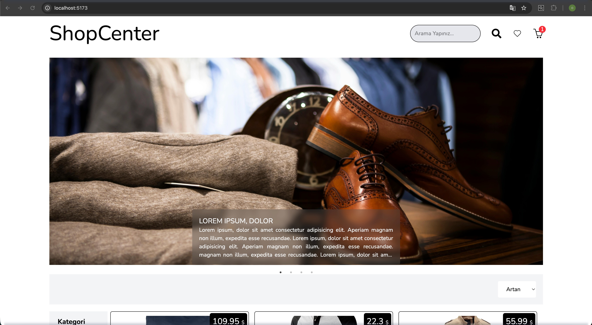

# ShopZon - E-Commerce Application

ShopZon is an e-commerce platform built with modern web technologies, providing a seamless and user-friendly shopping experience.

## 🚀 Features

Dynamic Product Listing: Filter products by category and sort them by price.

Product Details: View detailed information and adjust quantity based on stock.

Cart Management: Add/remove items and automatic calculation of total amounts.

Pagination: Organized data display using react-paginate.

Responsive Design: Fully responsive UI powered by Tailwind CSS 4.

## 🛠️ Tech Stack

Framework: React 19

State Management: Redux Toolkit (Thunk)

Routing: React Router DOM v7

Styling: Tailwind CSS v4

UI Components: React Icons, React Slick, React Paginate

API: FakeStore API

## ShopZon - E-Ticaret Uygulaması

ShopZon, modern web teknolojileri ile geliştirilmiş, kullanıcı dostu bir alışveriş deneyimi sunan bir e-ticaret platformudur.

## 🚀 Özellikler

Dinamik Ürün Listeleme: Ürünleri kategorilere göre filtreleme ve fiyata göre sıralama.

Detay Sayfası: Ürün detaylarını inceleme ve stok durumuna göre adet belirleme.

Sepet Yönetimi: Ürün ekleme, silme ve toplam tutarın otomatik hesaplanması.

Pagination: Büyük veri setlerini react-paginate ile sayfalara bölme.

Responsive Tasarım: Tailwind CSS 4 ile tüm cihazlara uyumlu arayüz.

## 🛠️ Teknoloji Yığını

Framework: React 19

State Management: Redux Toolkit (Thunk)

Routing: React Router DOM v7

Styling: Tailwind CSS v4

UI Components: React Icons, React Slick (Slider), React Paginate

API: FakeStore API (Ürün verileri için)

## Screenshot

## Screenshot

